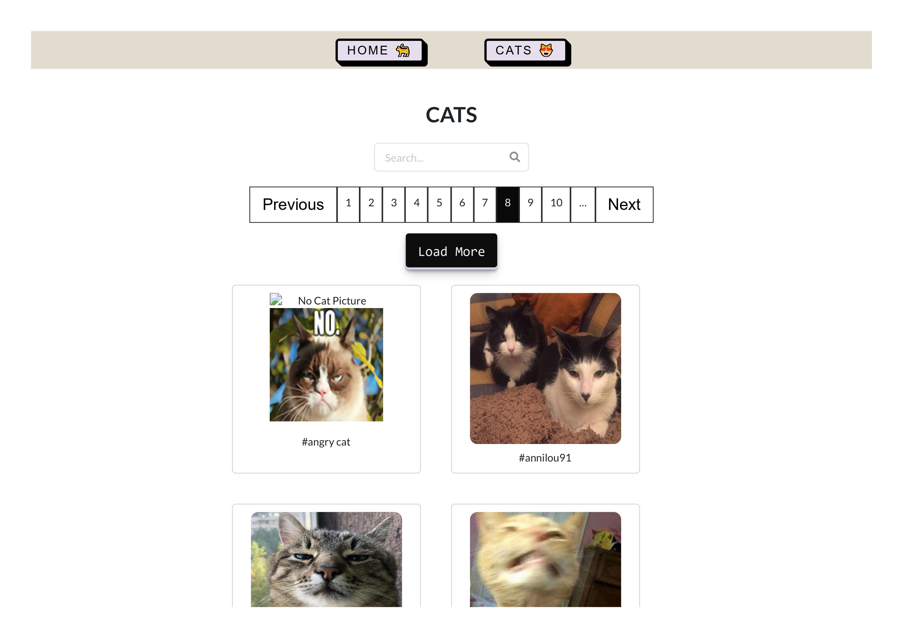
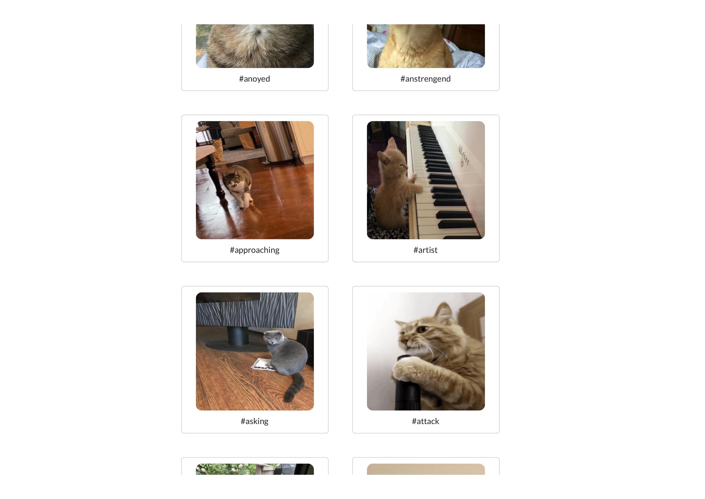
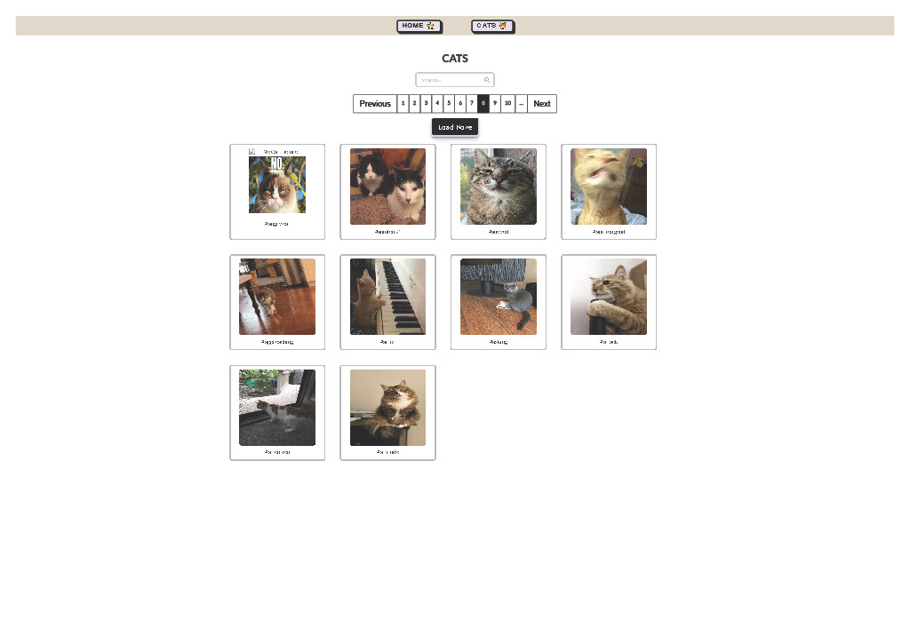

# CAT A A S project created with React

Fetching cat as a service API [https://cataas.com]

## Available Scripts

In the project directory, you can run:

### `npm run start`

To run the app in the development mode.\
Open [http://localhost:3000](http://localhost:3000) to view it in your browser.


## Environmental variable

REACT_APP_URL --> Backend server


## Other npm packages

```python
# Axios for API's requests
npm install axios

# React Router DOM
npm i react-router-dom

# Styled with Bootstrap
npm i bootstrap

# Loading spinners
npm i react-spinners

```

## Back-end  
 
Backend repository --> [lodus-cat-server](https://github.com/Mog-Rouhi/ludus-cat-server)







